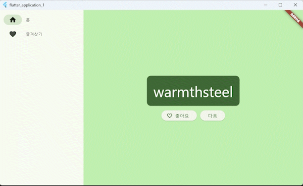

# flutter_first_app

Flutter를 학습하기 위해 다음 튜토리얼을 따라 제작된 데스크톱용 단어장 앱입니다.

-   [Lab: Write your first Flutter app](https://docs.flutter.dev/get-started/codelab)

## 기능

-   홈 화면에 1개의 단어 표시
-   '다음' 버튼으로 새로운 단어 확인
-   '💚좋아요' 버튼으로 좋아요 표시
-   🏠홈, 💚즐겨찾기 탭에서 영단어와 좋아요한 단어 목록 확인

## 미리보기

